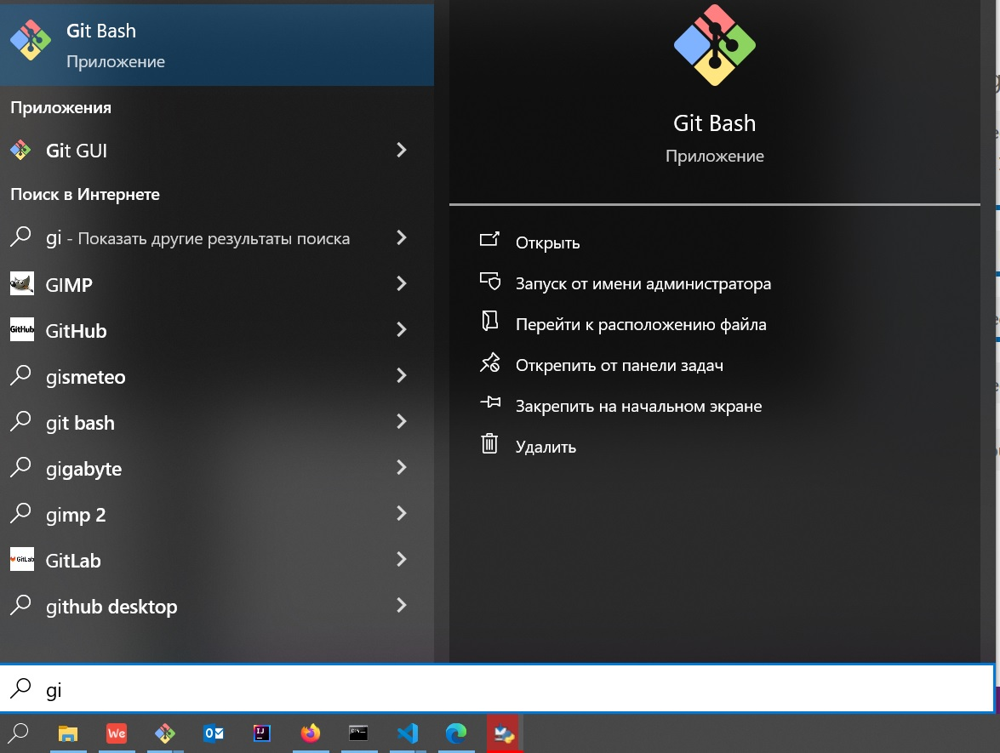

## Командная строка

### Cool hacker 101

> Наша задача на сегодня:
> - создать папку для ваших лаб 
> - скачать тестовый проект
> - посмотреть, какие там файлы
> - запустить проект

> Далее я буду называть папку "директория", не пугайтесь :)

1. Скачайте и установите [`git bash`](https://git-scm.com/download/win)

Почти наверняка вам нужна версия `64-bit Git for Windows Setup.`

2. Откройте `git bash` через меню "Пуск".

`git bash` открывает опредленную директорию по умолчанию (она называется домашняя директория или `home`).

В `git bash` вы можете ходить по файловой системе, исполнять какие-то команды и просматривать файлы.
В общем, чем-то похоже на обычный проводник в винде.

3. Создадим директорию с названием `code`. Для этого напишем `mkdir code` и нажмем `Enter`

Что мы сделали:
- `mkdir` - имя команды. Это команда, которая создает директорию
- `code` - аргумент команды. В данном случае это название директории, которую нужно создать
- директория `code` создается в `текущей директории`. это та директория, до которой мы "дошли" в нашем консольном проводнике. поскольку мы еще никуда не ходили, то мы находимся в `домашней директории`

4. Зайдем в нашу директорию: введите `cd code` и нажмите Enter

Что мы сделали:
- `cd` - имя команды, сокращенно от change directory. это команда, которая меняет нашу директорию на указанную
- `code` - название директории, в которую мы будем заходить

> У файлов и директорий есть полный путь и относительный.
> В данном случае мы указали `относительный`, т.е. относительно текущей директории

5. Попробуем создать в этой директории какой-нибудь файл. Для этого можно написать `touch myfile.txt` и нажать `enter`

Что мы сделали:
- `touch` - создает файл с данным именем. Внимание: директории он не создает, только файлы!
- `myfile.txt` - название файла, который мы хотим создать (в текущей директории)

6. Отредактируем созданный файл (сделаем это через `Блокнот` для простоты). Для начала поймем, где мы создали файл - `pwd` и нажать `Enter`

`pwd` - print working directory, печатает нашу текущую директорию (до которой мы дошли)

> `pwd` печатает полный путь, то есть весь путь, включая все директории "сверху"

7. Перейдем в `Проводнике` в ту директорию, которую напечатал `pwd`

У меня это `/c/Users/artfly/code`, у вас путь будет чуть иной. Что тут что:

- `/с` - это `Диск С:` в Проводнике. Похожим образом называются другие диски
- `/` - это разделитель между уровнями папок. То есть у меня на диске `C:` есть директория `Users`, в ней есть директория `artfly` и так далее.

8. Отредактируйте файл `myfile.txt` в `Блокноте`, можете там написать что угодно, но не забудьте сохранить

9. Снова переходим в `git bash` (если вы его закрыли, то зайдите снова в директорию `code`). Посмотрим там новое содержимое файла - для этого сделаем `cat myfile.txt` и нажмем `enter`

Что мы сделали: 
- `cat` - показывает содержимое файла (с котиками не связано)
- `myfile.txt` название файла

> Для разнообразия можете еще попробовать сделать то же самое, указав полный путь до файла.
> В моем случае это `cat /c/Users/artfly/code/myfile.txt`. Прикол писать такую длинную строчку в том, что ваша команда сработает и в другой директории (например в /с/)
> Если указать относительный путь, то он будет `относителен` относительно текущей директории...ну, в общем вы поняли..

10. Теперь скачаем питоновский проект и попробуем его запустить. Чтобы скачать нам нужно сначала настроить `git`. Он у нас уже установлен вместе с `git bash`, осталось рассказать ему, кто мы такие :)

11. Зарегистрируйтесь на [гитхабе](https://github.com/). Не забудьте свой логин, почту и пароль, они вам скоро понадобятся!

12. Теперь в git bash нужно сделать две команды (ВНИМАНИЕ! Не забудьте поменять текст, где нужно):

- git config --global user.name "github_username", где `github_username` нужно поменять на ваш ник на гитхабе. Нажмите потом "Enter"
- git config --global user.email myemail@example.com , где `myemail@example.com` нужно поменять на вашу почту, которую вы использовали для регистрации на гитхабе. Нажмите `Enter`.

13. Скачаем нужный нам репозиторий - `git clone https://github.com/artfly/python-test-repo.git`. `git` спросит у нас пароль, введите тот, который используете на гитхабе.

Что мы сделали:

- `git clone` - команда, которая скачивает нужный нам проект. подробности на лекции!
- https://github.com/artfly/python-test-repo.git - то, откуда скачивать
- `git clone` будет скачивать какое-то время, не пугайтесь, что все зависло

14. Проверим, что проект скачался. Напишем `ls` и нажмем `Enter`

`ls` показывает, что за директории и файлы находятся в текущей директории.
Мы сейчас в директории `code` (мы в нее ранее перешли). На данный момент у вас там должны быть:
- файл `myfile.txt`
- директория `python-test-repo`

15. Перейдите в `python-test-repo`. Уверен, что вы справитесь :)

16. Посмотрим, что в этой директории есть (да-да, опять `ls`)

Там должен быть один файл `hello.py`. Это, собственно, тот "проект", который нам нужно будет запустить

17. Осталось всего ничего - запустим питоновский скрипт из `git bash`. Сначала проверим, установлен ли у нас питон. Для этого напишите команду `winpty python3` и нажмите `Enter`. Если он ругается типа "command not found", то можем еще попробовать `winpty python`. Если опять облом, то надо питон скачивать (об этом в разделе `как скачать питон`)

В итоге должно появиться что-то такое:

> `winpty` - это специфичная для винды штука, чтобы питон все таки запустился. если вам хочется просто писать `python что_то_там`, то попросите у меня, я вам настрою.

Это интерпретатор питона, здесь можно писать мини-программки чтобы что-то проверить. Можете как калькулятор еще использовать.
Но вообще этот режим нам сейчас не нужен, нам нужно определенную уже написанную программу запустить. Поэтому давайте выйдем из интерпретатора, для этого вызовите функцию `quit()` и нажмите `enter`

> Важно: версия вашего питона должна быть 3.что_нибудь_там. Питон 2.что_нибудь_там не подойдет, он ожидает чуть другой код, чем мы будем писать на парах

18. Наберите в `git bash` `winpty python hello.py` и нажмите `Enter`. После этого у вас должен сработать скрипт hello, и вывести вам сообщение на экран.

19. Супер, последний шаг! Запишите свой логин [сюда](https://docs.google.com/document/d/1OldyplEPeJB4NwTvm8fBKeoFUl9uJE__kQ4bOo6QdvE/edit?usp=sharing), это очень важно, иначе я не проверю ваши лабы!

Что мы сделали:

- `winpty python` - наш интерпретатор питона. у него есть интерактивный режим - когда мы печатаем команды туда. а есть режим, когда даем файл и он из него читает программу и выполняет. мы сейчас делаем по второму варианту
- `hello.py` - название программы/скрипта, который нужно выполнить
- помимо этого у питона есть еще много разных режимов, некоторые из них мы еще попробуем

19. Ура, победа!!111!1! Вы дошли до последнего шага, вы молодец :) Для интереса можно еще почитать раздел "Как облегчить себе жизнь", чтобы стать совсем уж настоящим хакером

### Как облегчить себе жизнь

В этом разделе собран набор всяких трюков, которые помогают вам быстрее что-то сделать в git bash, зависть одногруппников обеспечена

1. Тильда, точка и две точки

Чтобы не писать каждый раз длинные названия папок, можно воспользоваться сокращениями. Покажу на примере команды `cd`:

- `cd ~` - перейти в домашнюю директорию
- `cd ..` - перейти на уровень выше
- `cd .` - перейти в текущую директорию, то есть по сути остаться на месте. для `cd` бесполезно, но иногда бывает нужно для других команд

2. Автодополнение

Если вы такой же ленивый как я, то вы печатать не хотите, хотите, чтобы за вас это компьютер делал. И он это умеет, пытаясь дополнить, что вы ввели.

Например:
- можно в `git bash` начать писать `gi` и нажать `tab`. получите дополнение до `git`. согласен, тут мы усилия не сэкономили, но на более длинных командах будет полезно
- можно название папок дополнять тоже. например, в домашней директории написать `cd co` и нажать `tab` если у вас там нету других файлов и папок, начинающихся на `co`, то он до `code` дополнит. Если есть, то предложит варианты

3. История команд

Иногда я становлюсь еще ленивее и хочу повторить какую-то старую команду целиком, а не автодополненять ее по частям. 
Для этого можно просто найти команду в истории команд. Чтобы начать поиск нажмите "ctrl+r". Попробуйте что-то начать печатать, например букву `g`. Скорее всего, он вам предложит команду `git clone ...`, которую мы делали ранее. 
Чтобы ее выбрать и начать еще как-то менять, нажмите `Enter`. Помните, что история команд ограничена, через 50 лет внукам команды уже показать не выйдет.

4. Удаление и перемещение

Опасные, но нужные команды:

`rm` - удаляет что вы ей скажете. Есть два режима, посмотрим на примерах (если будете исполнять, то учтите, что файлы совсем удалятся, а не в `Корзину` переедут):

- `rm -r code` - удалить директорию `code`. `-r` (рекурсивно) говорит, что нужно удалить еще и все внутри
- `rm myfile.txt` - удалить файл. тут рекурсивность не нужна, в файле нету подфайлов :)

`mv` - перемещает/переименовывает файл или папку. Пример:

- `mv myfile.txt awesomename.txt` - переименовывает файл `myfile.txt` в `awesomename.txt`
- `mv myfile.txt python-test-repo/awesomename.txt` - еще и перемещает его в директорию `python-test-repo`. хз, зачем

5. Экранирование путей

Если ваша директория содержит в имени пробелы, то вы в нее просто так не зайдете.

Например, `cd Мои Документы` выдаст вам ошибку - не может понять, куда идти. 
Происходит это потому что все команды читают имена директорий до пробела, т.е. в данном случае наша команда превращается в `cd Мои`. Чтобы все сработало хорошо, нужно объяснить `git bash`'у, что это все длинное и дурацкое имя файла, для этого перед пробелом нужно поставить обратный слэш `\`. `cd Мои\ Документы` - так сработает.

6. `ctrl+c`

`ctrl+c` - это вообще универсальное сочетание клавиш, оно позволяет завершить текущую команду. 
Например, вы написали в вашем скрипте бесонечный цикл `for`, запустили ваш скрипт и непонятно, что делать дальше.
Можно, конечно, крестиком окно `git bash` закрыть, а можно нажать на клавиатуре `ctrl+c` и дальше в том же окошке работать.
Обратите внимание, `ctrl+c` программу прерывает, то есть до конца она может и не успеть доработать.

### Как скачать питон

1. Заходим на python.org/downloads
2. Нажимаем большую желтую кнопку "Download Python 3.13.7"
3. Запускаем установку
4. На первом экране обязательно нажмите галочку "Add python.exe to PATH"
5. Нажмите Customize installation, откроется новый экран. Убедитесь, что все галочки нажаты, нажмите `Next`
6. Нажмите галочку "Install Python 3.13 for all users". Расположение установки выберите на ваш вкус. Нажмите `Install`
7. Соглашайтесь на все, что вам предлагает установщик в процессе :)
8. После того, как установится, надо проверить, что мы справились: откройте новое окно `git bash`
9. Попробуйте в нем написать `winpty python -V` и нажать `Enter` На экране должно появиться что-то про `Python 3.13.7`
10. Перейдите снова в директорию нашего проекта (`cd code/python-test-repo`) и продолжайте
